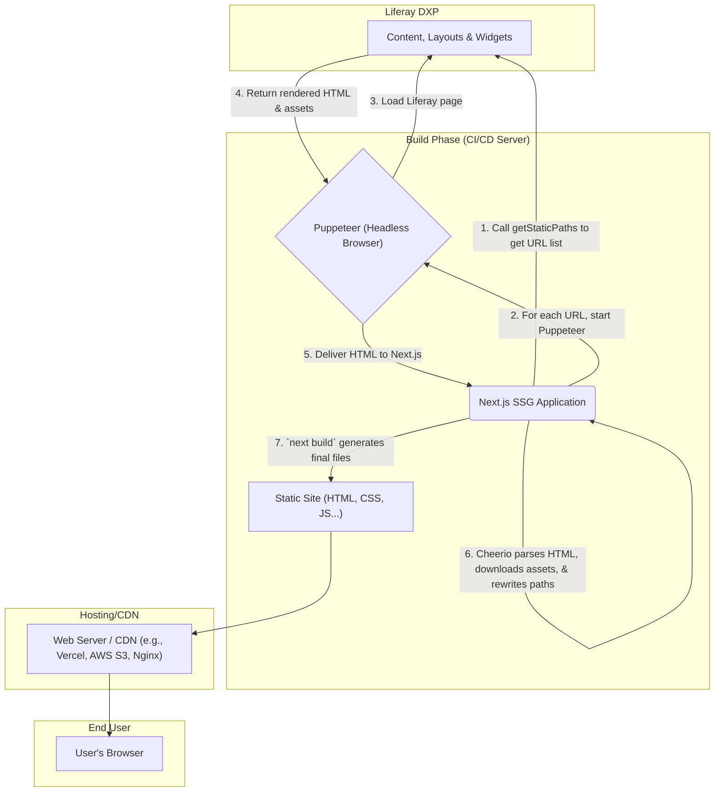

# Liferay SSG Extractor with Next.js

## 1. Objective

The main objective of this project is to transform a dynamic website managed in Liferay DXP into a high-performance static website. This allows leveraging the benefits of a static site (loading speed, security, scalability, low hosting costs) without sacrificing Liferay's powerful content management and page-building capabilities.

## 2. Adopted Approach: "Scrape & Bake"

To achieve the objective, a **"Scrape & Bake"** approach has been adopted.

Unlike a traditional SSG (Static Site Generation) which relies on consuming data APIs (JSON) to then rebuild views with React components, this solution opts for a method more faithful to the original:

1.  **Scrape**: A programmable browser (Puppeteer) is used to visit each page of the Liferay site as if it were a user. It waits for the page to fully render in the browser, including all client-side JavaScript logic.
2.  **Bake**: Once the final HTML is obtained, it is "baked" into a static page. This process involves parsing the captured HTML, downloading all its assets (CSS, JS, images, fonts), rewriting the paths to be local, and packaging everything into a production-ready file structure.

This approach was chosen because it ensures the **highest visual and functional fidelity** with the original Liferay site, capturing the output of complex widgets and applications that would be difficult or impossible to replicate using only data APIs.

## 3. Architecture Description

The solution is composed of the following key elements:

*   **Liferay DXP**: Acts as the source of truth and content management environment. Pages, content, widgets, and layouts are managed and rendered here.
*   **Next.js Application (`/extractor/liferay-nextjs-ssg`)**: This is the extraction and generation engine.
    *   **Puppeteer**: Headless browser (no GUI) that loads each public Liferay page.
    *   **Cheerio**: A library that parses the HTML captured by Puppeteer to extract, download, and rewrite all assets and links.
    *   **Next.js SSG Mechanism**:
        *   `getStaticPaths`: Runs at build time to get the list of all pages that must be generated.
        *   `getStaticProps`: Orchestrates the entire "Scrape & Bake" process for each individual page.
*   **Static Site (`/out` directory)**: The final result of the `next build` process. It contains pure HTML, CSS, and JS files that can be deployed to any static web server or CDN.

## 4. Architecture Diagram



## 5. Complete Workflow

The process to generate and deploy the static site is as follows:

1.  **Configuration**: Create a `.env.local` file in the `extractor/liferay-nextjs-ssg/` directory with the following environment variables:
    ```
    # Liferay API endpoint to get the list of pages
    LIFERAY_API_ENDPOINT="http://localhost:8080/o/c"

    # Host of the Liferay instance (for Puppeteer to visit)
    LIFERAY_HOST="http://localhost:8080"

    # Optional path prefix if Liferay is not served from the root (e.g., /web)
    LIFERAY_PATH_PREFIX="/web"

    # ID of the Liferay site to be extracted
    LIFERAY_SITE_ID="12345"

    # Credentials of a user with permissions to access the APIs and pages
    LIFERAY_API_EMAIL="test@liferay.com"
    LIFERAY_API_PASSWORD="password"
    ```

2.  **Install Dependencies**: Navigate to the extractor directory and run:
    ```bash
    cd extractor/liferay-nextjs-ssg
    npm install
    ```

3.  **Static Site Generation**: Run the Next.js build command. This process can take several minutes depending on the number and complexity of the pages.
    ```bash
    npm run build
    ```
    This command will orchestrate the entire "Scrape & Bake" process. The final output will be saved in the `out` directory.

4.  **Local Verification (Optional)**: To test the generated static site before deploying, you can use the `start` command:
    ```bash
    npm run start
    ```
    This will start a local server at `http://localhost:3000` serving the content from the `out` directory.

5.  **Deployment**: Copy the contents of the `extractor/liferay-nextjs-ssg/out` directory to a static web server or a hosting/CDN service of your choice.
